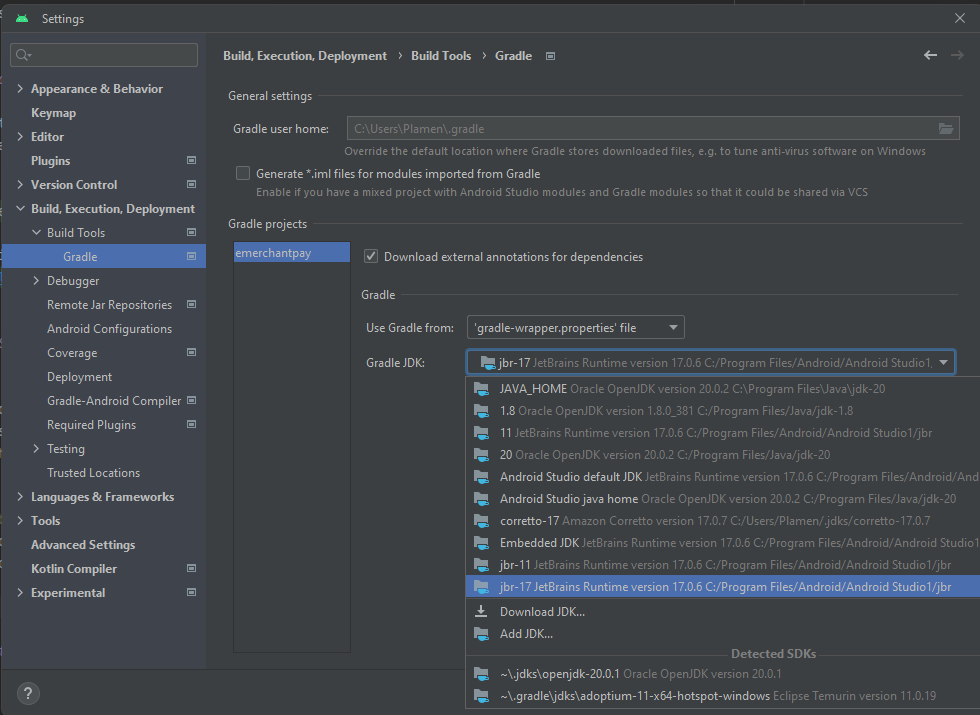

# Atomic.io Application Task

## About
An Android Library that provides an UI component that renders a _Sport_ ([see task requirements](docs/android_task.pdf)) . A shell app using the library included in the proejct
- This app has been developed as part of a technical task interview to demonstrate the candidate's skills in Android app development.
- The solution is heavily inspired by clean architecture principles.
- Complete task details can be found here [here](docs/android_task.pdf)
   - UI is built using Jetpack Compose 
   - Hilt is the choice of DI Framework
   - Both **Unit** and **Instrumentation** tests are provided

## Built With 🛠
- [Kotlin](https://kotlinlang.org/) - First class and official programming language for Android development.
- [Coroutines](https://developer.android.com/kotlin/coroutines) - Kotlin coroutines are a feature used for simplifying asynchronous programming and concurrent tasks, offering structured, readable, and efficient code..
- [Jetpack Compose](https://developer.android.com/jetpack/compose) = Android UI toolkit that simplifies and accelerates the development of native Android user interfaces with a declarative and modern approach.
- [ViewModel](https://developer.android.com/topic/libraries/architecture/viewmodel) - Stores UI-related data that isn't destroyed on UI changes.
- [Hilt](https://dagger.dev/hilt/) - Dependency Injection Framework

## How to Install
Simply clone the project in Android Studio, Sync the dependencies and you are ready to run it 

**`Troubleshooting:`** The most common error that happens when importing a new project is build failure and is due to
  improper java version set for this project. If build fails, make sure you have the proper version of java set.

   - Go to `File`-> `Settings` -> `Build, Execution, Deployement` -> `Build Tools`-> `Gradle`

   - This project was test with`Jbr-11` and `jbr-17` setting `Gradle JDK` to any of them should resolve build issues.

     